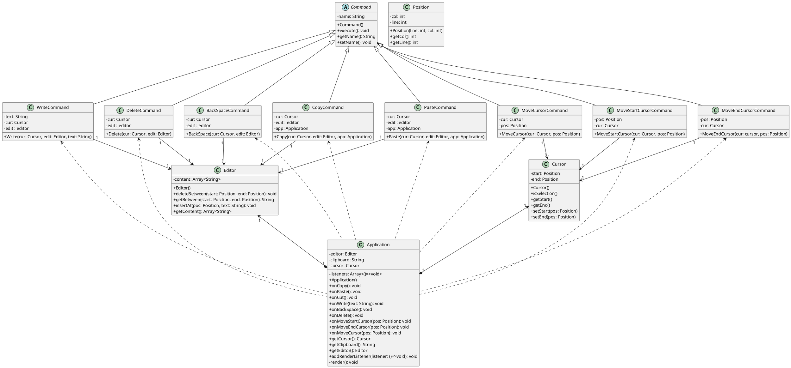
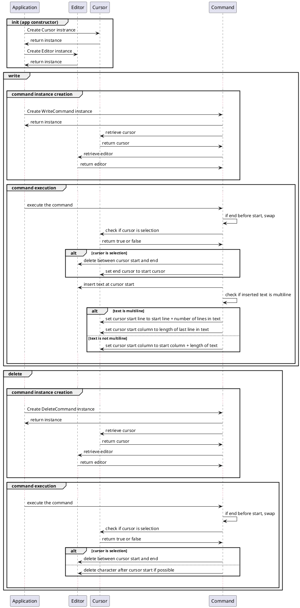
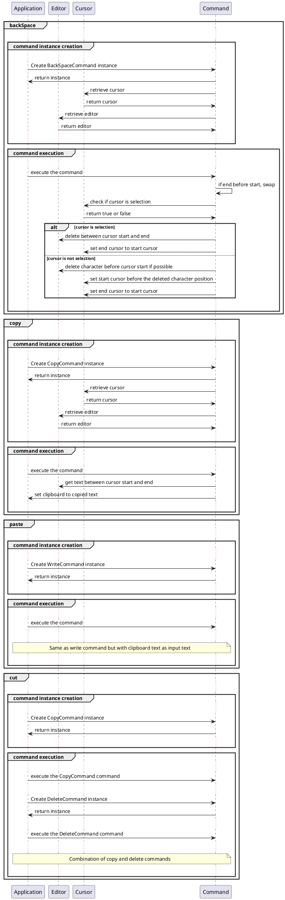
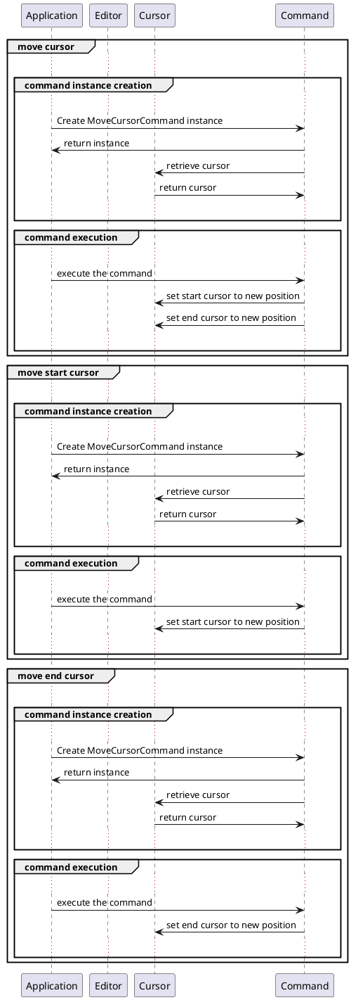
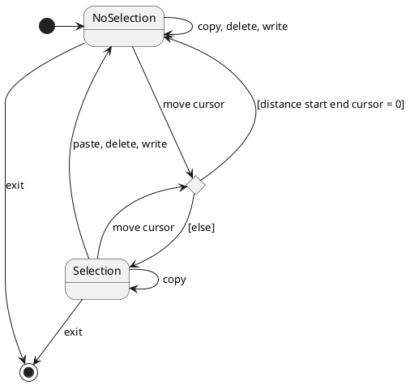
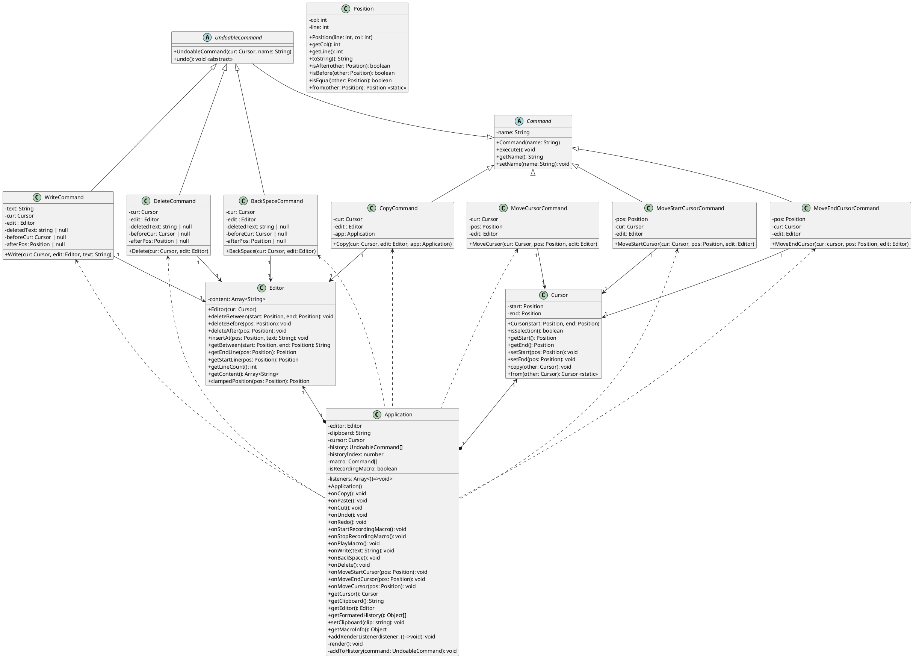
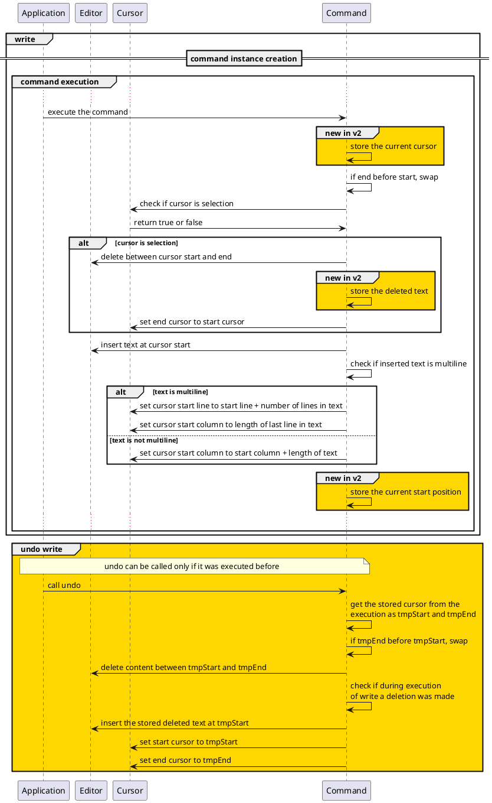
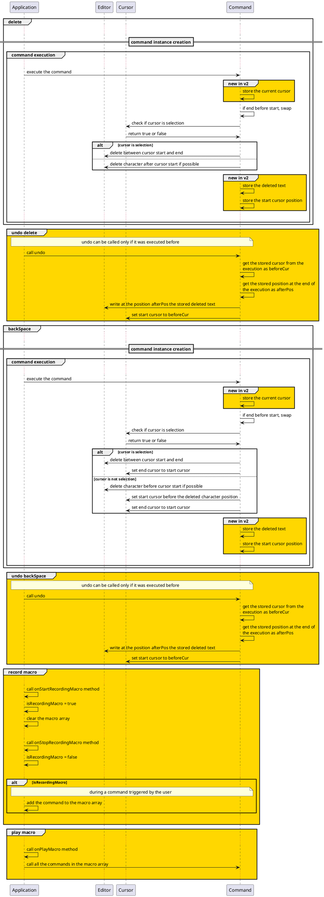
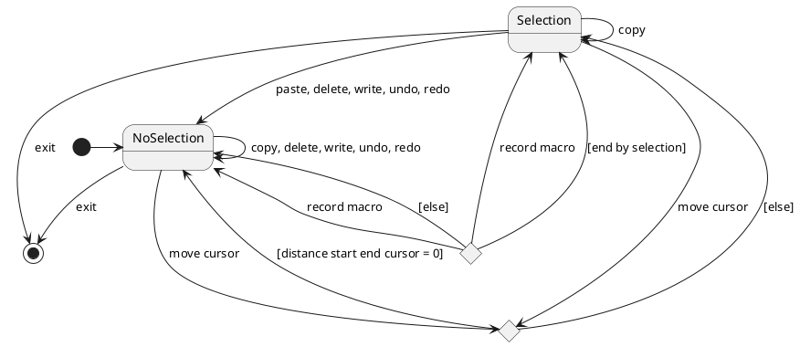

Par Cody ADAM
et Thomas DELAPART

- [Comment compiler le projet](#comment-compiler-le-projet)
  - [1 - Aller à la racine du projet](#1---aller-à-la-racine-du-projet)
  - [2 - Installer les dépendances](#2---installer-les-dépendances)
  - [3 - Compiler le projet](#3---compiler-le-projet)
  - [4 - Lancer le projet](#4---lancer-le-projet)
  - [5 - Ouvrir la page web](#5---ouvrir-la-page-web)
- [I. Introduction](#i-introduction)
- [II. Cahier des charges](#ii-cahier-des-charges)
  - [Cahier des charges:](#cahier-des-charges)
    - [V1](#v1)
    - [V2](#v2)
  - [Plan](#plan)
- [III. Planification et implémentation de la v1.0](#iii-planification-et-implémentation-de-la-v10)
  - [III.1 Diagramme de classe](#iii1-diagramme-de-classe)
  - [III.2 Diagramme séquence](#iii2-diagramme-séquence)
  - [III.3 Diagramme d'état](#iii3-diagramme-détat)
  - [III.4 Implémentation de l'éditeur](#iii4-implémentation-de-léditeur)
  - [III.5 Changements apportés](#iii5-changements-apportés)
- [IV. Réorganisation, et implémentions de la v2.0](#iv-réorganisation-et-implémentions-de-la-v20)
  - [IV.1 Diagramme de classes](#iv1-diagramme-de-classes)
  - [IV.2 Diagramme de séquence](#iv2-diagramme-de-séquence)
  - [IV.3 Diagramme d'état](#iv3-diagramme-détat)
  - [IV.4 Implémentation de l'éditeur](#iv4-implémentation-de-léditeur)
- [V. Conclusion](#v-conclusion)

# Comment compiler le projet

## 1 - Aller à la racine du projet

```
cd code
```

## 2 - Installer les dépendances


```bash
npm install # Avec npm (requiert nodejs ainsi que npm)
# ou
yarn # Avec yarn (requiert nodejs ainsi que yarn)
```

## 3 - Compiler le projet

```bash
npm run build # Avec npm
# ou
yarn build # Avec yarn
```

## 4 - Lancer le projet

```bash
npm run start # Avec npm
# ou
yarn start # Avec yarn
```

## 5 - Ouvrir la page web

la page web est disponible à l'adresse [http://localhost:1234](http://localhost:1234)


# I. Introduction

Dans ce TP, nous allons nous pencher sur la conception d'un éditeur de texte. Avant de nous jeter dans la programmation, nous étudierons le fonctionnement d'un éditeur de texte. Nous verrons quelles sont ses fonctionnalités principales, leurs attributs et leur agencement en classe. Puis, nous regarderons les différentes interactions entre-elles et les différents états de l'éditeur. Pour nous permettre d'avoir enfin un code le plus compréhensible, organisé et modulaire possible.

# II. Cahier des charges

Comme pour le TP1, nous cherchons à nous approprier le sujet en faisant un cahier des charges plus lisible et plus adapté à la situation que l'énoncé.

## Cahier des charges: 

### V1

- Le texte est contenu dans un buffer (zone de travail)
- Il existe une notion de sélection de texte, avec des commandes utilisateur permettant de déplacer le début et la fin de la sélection
- Copie de la sélection dans le presse-papier
- Copie de la sélection dans le presse-papier puis effacement de la sélection
- Remplacement (« collage ») de la sélection par le contenu du presse-papier
- L'interface homme-machine est d'un type quelconque (textuelle ou graphique)

### V2

- D'enregistrer/rejouer les actions de l'utilisateur (e.g., script)
- De réaliser le défaire/refaire, avec une capacité quelconque dans le défaire 
(autrement dit, on peut revenir au début)

## Plan
Avec notre cahier des charges, nous définissons ensuite les différents graphiques UML qui nous seront nécessaires avant de commencer l'implémentation :
- Diagramme de classe
- Diagramme séquence
- Diagramme d'état

# III. Planification et implémentation de la v1.0

## III.1 Diagramme de classe

Ayant une idée générale des objectifs du projet, nous pouvons réfléchir à quelles classes remplissent aux mieux les fonctionnalités demandées et quelles sont leur interaction. Nous avons pris le soin de suivre au mieux les principes de conception vus en cours. Tel que les principes SOLID ainsi que le "command pattern" 

Nous avons donc décidé de créer le diagramme de classe suivant :


Nous avons choisi comme principales classes de notre projet : **"Editor"**, **"Application"**, **"Command"** et **"Cursor"**. 

- **"Application"** est la classe principale qui contient les différentes commandes et qui permet à l'utilisateur de les exécuter. C'est elle qui fait le lien avec l'interface utilisateur.
  
Dans la classe Application, nous pouvons trouver l'attribut `listener` et les deux méthodes `render` et `addListener` qui sont utilisés pour mettre à jour l'interface utilisateur.

- **"Editor"** est la classe qui contient le contenu du buffer, elle seule peut modifier le contenu du buffer.

- **"Command"** est une classe abstraite qui permet de définir les différentes commandes qui utiliseront les fonctions de "Editor".

- **"Cursor"** est la classe qui contient les **"Position"** s du curseur et qui permet de définir s'il y a une sélection.


## III.2 Diagramme séquence

Disposant maintenant de notre diagramme de classes, ainsi que des principales classes, nous pouvons définir les interactions entre celles-ci. Nous avons donc décidé en reprenant nos quatre classes de créer le diagramme séquence suivant :






Nous avons défini 8 interactions principales entre les classes au sein de notre éditeur de texte :

- **init** : permet d'initialiser l'application avec un éditeur et un curseur.

- **write** : permet d'écrire du texte dans le buffer.

- **delete** : permet de supprimer du texte après le curseur dans le buffer.

- **backSpace** : permet de supprimer du texte avant le curseur dans le buffer.

- **copy** : permet de copier du texte en le stockant dans le **clipboard**.
   
- **paste** : permet de coller du texte du **clipboard** dans le buffer.
  
- **cut** : permet de copier du texte en le stockant dans le **clipboard** et de supprimer la sélection.

- **move cusror** : permet de déplacer les deux curseurs (début et fin) à la même position.

- **move start cursor** : permet de déplacer le curseur de début. (utile pour les sélections)

- **move end cursor** : permet de déplacer le curseur de fin. (utile pour les sélections)

## III.3 Diagramme d'état

Sachant désormais comment est construit et fonctionne notre éditeur de texte, nous pouvons essayer de trouver et de définir les différents états de notre application. Nous avons donc fini par définir le diagramme d'état suivant : 




Nous avons défini deux états principaux : **"Selection"** et **"NoSelection"** pour notre Éditeur. Notre application ne fait qu'alterner entre ces deux états selon les commandes effectués. Pour cette alternance, nous avons également défini un état intermédiaire qui permet de définir si la commande **"move cursor"** va aboutir à un changement d'état ou non.


## III.4 Implémentation de l'éditeur

Nous avons décidé d'implémenter notre éditeur de texte en langages Web soit en TypeScript. Nous avons ainsi programmé notre éditeur en utilisant l'architecture de notre diagramme de classes. Fabriquant ainsi les fichiers suivants :

- **app.ts** : la classe principale de notre application qui permet de gérer les commandes ainsi que les interactions avec l'utilisateur
- **commands.ts** : implémentation de toutes les commandes
- **cursor.ts** : implémentation de la classe **Cursor**
- **editor.ts** : implémentation de la classe **Editor**
- **position.ts** : implémentation de la classe **Position**
- **index.ts** : fichier annexe qui permet d'exporter la classe principale (n'est pas important pour la compréhension du projet)
  
Nous fabriquons ensuite l'interface graphique de notre éditeur de texte en utilisant le framework graphique **"three.js"**. Celui-ci va nous permettre d'avoir d'avoir une interface constituée de modèles 3D, ce qui rend le projet ludique. Ce choix technique nous permet également de ne pas réutiliser les fonctions de base du navigateur web pour la sélection, le copier/coller, etc.

Vous retrouverez les instructions pour lancer le projet dans le fichier **README.md** du projet ou lancer la version en ligne [ici](https://editor.codyadm.com/).


## III.5 Changements apportés

Au fil de l'implémentation, nous avons ajouté quelques fonctions utilitaires à nos classes dans le but de clarifier le code et de faciliter le développement au long terme.

Voici la liste des changements apportés :

- `editor.clampedPosition` : permet de retourner la position valide la plus proche de celle passée en paramètre
- `editor.getStartLinePos` : permet avec le numéro d'une ligne d'avoir la position de début de la ligne
- `editor.getEndLinePos` : Hervé permet avec le numéro d'une ligne d'avoir la position de celle-ci
- `position.isAfter` : permet la comparaison entre deux positions
- `position.isBefore` : 
- `position.isEqual` : 


# IV. Réorganisation, et implémentions de la v2.0

Nous avons maintenant une version 1 du projet parfaitement opérationnelle. Celui-ci a une architecture organisée et modulaire, ainsi qu'une interface graphique permettant à l'utilisateur de se servir des différentes commandes.

Cependant, nous avons remarqué que notre éditeur de texte ne permet pas de faire les fonctionnalités avancées de notre cahier des charges. Nous passons ainsi à une version 2 de notre éditeur de texte, qui permettra à l'utilisateur :


- D'enregistrer/rejouer les actions de l'utilisateur (e.g., macro) 
- De réaliser le défaire/refaire, avec une capacité quelconque dans le défaire 
(autrement dit, on peut revenir au début)


## IV.1 Diagramme de classes

Nous réalisons une extension de notre Diagramme de classes pour la version 2 de notre éditeur de texte qui reprend le diagramme de la version 1 comme structure initiale. Nous avons fini par définir le nouveau diagramme de classes suivant : 



Dans cette version 2, nous avons décidé de définir la classe **"UndoableCommand"** qui défini la méthode abstraite `undo()`. Nous pourrons donc, via une liste de UndoableCommand, représenter notre "historique" de commande que nous pouvons annuler avec la méthode `undo()` ou refaire avec la méthode `execute()`. Cette liste permettra donc de pouvoir annuler et refaire autant de commandes que l'on souhaite à condition de ne pas saturer la mémoire.

Nous disposons également de nouvelles méthodes liées aux enregistrements de macros ou bien scripts dans notre programme. Ceux-ci sont représentés par une liste de `Command`es qui sont exécutées quand l'utilisateur lance le script.

## IV.2 Diagramme de séquence

Nous réalisons ici aussi une extension de notre Diagramme de séquence pour la version 2, car les interactions initiales sont toujours possibles pour l'utilisateur. Nous avons toutefois ajouté différentes méthodes qui vont dont les interactions vont être décrite via le nouveau diagramme de séquence suivant. Pour différencier les interactions de la version 1 et de la version 2, nous avons décidé de mettre en évidence les interactions de la version 2 en les colorant en orange.





Nous avons défini 4 interactions supplémentaires entre les classes au sein de notre éditeur de texte :

- **undo write** :  permet de revenir en arrière sur une écriture

- **undo delete** :  permet de revenir en arrière sur une suppression

- **undo backspace** :  permet de revenir en arrière sur une suppression avec la touche backspace

- **record macro** :  permet d'enregistrer une macro
  
- **play macro** :  permet de jouer une macro

## IV.3 Diagramme d'état

Ayant ainsi la nouvelle structure et le fonctionnent final de notre éditeur, nous pouvons définir quels sont les états définitifs de notre application et quelles actions engendrent des changements d'états. Nous avons donc fini par définir le diagramme d'état suivant :


Nous avons défini les mêmes états que pour la version 1 de notre éditeur de texte. Nous avons toutefois des changements d'états supplémentaires pour la version 2...

## IV.4 Implémentation de l'éditeur


Nous avons fabriqué pour la version 2, nous avons ajouté une interface pour visualiser l'historique de commande ainsi que l'état si la commande a été annulé ou non. Concernant l'interface graphique, nous avons ajouté un bouton **"Record"** qui permet d'enregistrer les commandes effectuées par l'utilisateur. Nous avons également ajouté un bouton **"Play"** qui permet de rejouer les commandes enregistrées par l'utilisateur.


# V. Conclusion

Dans ce TP, nous avons pu réaliser un éditeur de texte en 3D en utilisant le framework **"Three.js"** permettant à l'utilisateur de faire des actions de base telles que la sélection, le copier/coller, etc. Mais aussi des actions avancées telles que l'enregistrement/le rejeu des actions de l'utilisateur et le défaire/refaire à l'infini.

Serte la conception du projet qui nous a permis de nous familiariser d'autant plus avec le langage **"TypeScript"** et le Framework **"Three.js"**, mais nous a surtout permis de mener à terme un projet bien organisé. En effet, nous avons correctement défini notre structure avec les diagrammes UML de sorte qu'elle réponde parfaitement à nos attentes. De plus, grâce à la structure modulaire du projet, pu ajouter de nouvelles fonctionnalités sans difficultés à notre application.

C'est en conclusion une démarche claire et utile que nous serons surement amenés à reconduire pour nos futurs projets.