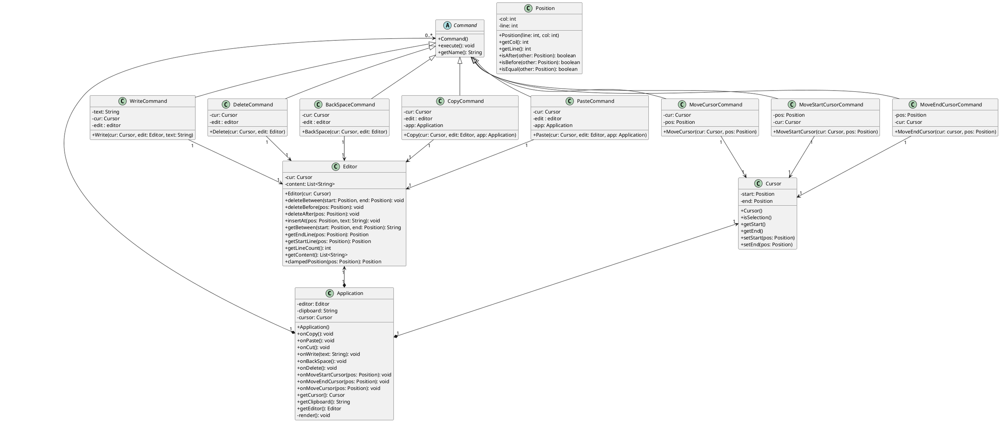
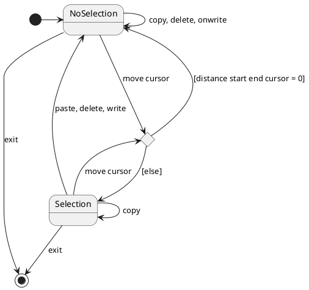
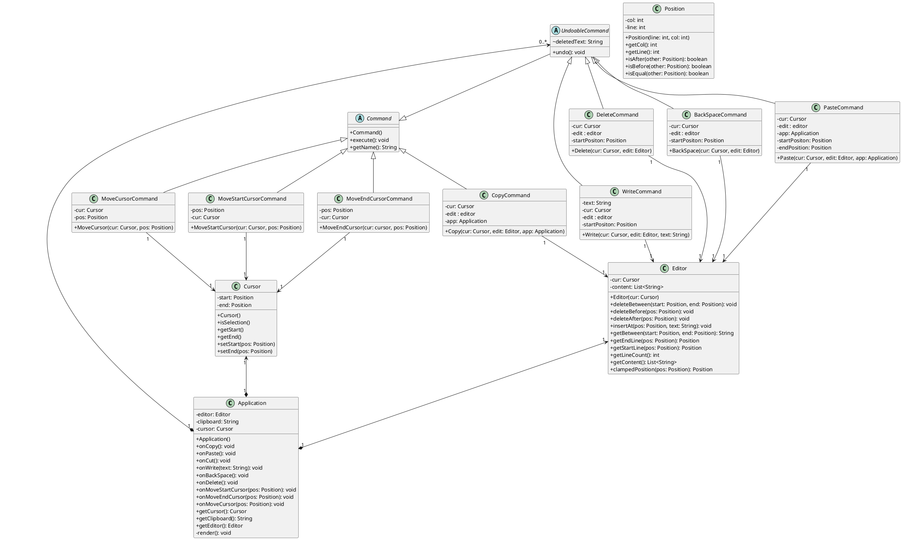
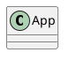
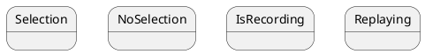

# I. Introduction
Dans ce TP, nous allons nous pencher sur la conception d'un editeur de texte. Avant de nous jeter dans la programmation, nous étudierons le fonctionnement d'un éditeur de texte. Nous verrons quelles sont ses fonctionnalités principales, leurs attributs et leur agencement en classe. Puis nous regarderons les différentes intéractions entre-elles et les différents états de l'éditeur. Pour nous permettre d'avoir enfin un code le plus compréhensible, organisé et modulaire possible.

# II. Cahier des charges

Comme pour le TP1, nous cherchons à nous approprier le sujet en faisant un cahier des charges plus lisible et plus adapté à la situation que l'énnoncé.

## Cahier des charges: 

### V1

- Le texte est contenu dans un buffer (zone de travail)
- Il  existe  une  notion  de  sélection  de  texte,  avec  des  commandes  utilisateur  permettant  de déplacer le début et la fin de la sélection
- Copie de la sélection dans le presse-papier
- Copie de la sélection dans le presse-papier puis effacement de la sélection
- Remplacement (« collage ») de la sélection par le contenu du presse-papier
- L'interface homme-machine est d'un type quelconque (textuelle ou graphique)

### V2

- D'enregistrer/rejouer les actions de l'utilisateur (e.g., script)
- De réaliser le défaire/refaire, avec une capacité quelconque dans le défaire 
(autrement dit on peut revenir au début)

## Plan
Avec notre cahier des charges nous définissons ensuite les différents graphiques UML qui nous seront nécessaires avant de commencer l'implémentation :
- Diagramme de classe
- Diagramme séquence
- Diagramme d'état

# III. Diagrammes UML et conception de la V1 

## III.1 Diagramme de classe

Ayant une idée générale des objectif du projet, nous pouvons réflechir à quelles classes remplissent aux mieux les fonctionnalités demandés et quelles sont leur interaction. Nous avons donc décidé de créer le diagramme de classe suivant :

Nous avons choisit comme principales classes de notre projet : **"Editor"**, **"Application"**, **"Command"** et **"Cursor"**. 

- **"Application"** est la classe principale qui contient les différentes commandes et qui permet à l'utilisateur de les exécuter. C'est elle qui fait le lien avec l'interface utilisateur.

- **"Editor"** est la classe qui contient le contenu du buffer, elle seule peut modifier le contenu du buffer.

- **"Command"** est une classe abstraite qui permet de définir les différentes commandes qui utiliserons les fonctions de "Editor".

- **"Cursor"** est la classe qui contient les **"Position"** s du curseur et qui permet de définir si il y a une sélection.

## III.2 Diagramme séquence

Disposant maintenant de notre diagramme de classes, ainsi que des principales classes, nous pouvons définir les interactions entre celles-ci. Nous avons donc décidé en reprenant nos quatres classes de créer le diagramme séquence suivant :

```plantuml
@startuml

participant Application as app
participant Editor as edit
participant Cursor as cur
participant Command as com

group init (app constructor)
    app -> cur: new Cursor()
    cur -> app: return instance
    app -> edit: new Editor(cur)
    edit -> app: return instance
end

group write
    app -> com: new WriteCommand(app, "toto")
    com -> app: return instance
    app -> com: execute()
    com -> edit: addStringBetween(text, cur.getStart(), cur.getEnd())
    edit -> com: return void
    com -> app: render()
    app -> com: return void
    com -> app: return void
end
group delete
    app -> com: new DeleteCommand(app)
    com -> app: return instance
    app -> com: execute()
    alt #Gold if cur.isSelection()
        com -> edit: deleteBetween(cur.getStart(), cur.getEnd())
        edit -> com: return void
    else #LightBlue else
        com -> edit: deletAfter(cur.getStart())
        edit -> com: return void
    end
    com -> app: render()
    app -> com: return void
    com -> app: return void
end
group backSpace
    app -> com: new BackSpaceCommand(app)
    com -> app: return instance
    app -> com: execute()
    alt #Gold if cur.isSelection()
        com -> edit: deleteBetween(cur.getStart(), cur.getEnd())
        edit -> com: return void
    else #LightBlue else
        com -> edit: deletBefore(cur.getStart())
        edit -> com: return void
    end
    com -> app: render()
    app -> com: return void
    com -> app: return void
end
group copy
    app -> com: new CopyCommand(app)
    com -> app: return instance
    app -> com: execute()
    com -> edit: getStringBetween(cur.getStart(), cur.getEnd())
    edit -> com: return String
    com -> app: setClipboard(String)
    app -> com: return void
    com -> app: return void
end
group paste
    app -> com: new PasteCommand(app)
    com -> app: return instance
    app -> com: execute()
    com -> app: getClipboard()
    app -> com: return String
    com -> edit: addStringBetween(clip, cur.getStart(), cur.getEnd())
    edit -> com: return void
    com -> app: render()
    app -> com: return void
    com -> app: return void
end

group cut
    app -> app: onCopy()
    app -> app: onDelete()
end

group move cursor
    app -> com: new MoveCursorCommand(app)
    com -> app: return instance
    app -> com: execute()
    com -> cur: setStart(Position)
    cur -> com: return void
    com -> cur: setEnd(Position)
    cur -> com: return void
    com -> app: return void
    com -> app: return void
end

group move start cursor
    app -> com: new MoveStartCursorCommand(app)
    com -> app: return instance
    app -> com: execute()
    com -> cur: setStart(Position)
    cur -> com: return void
    com -> app: return void
    com -> app: return void
end

group move end cursor
    app -> com: new MoveEndCursorCommand(app)
    com -> app: return instance
    app -> com: execute()
    com -> cur: setEnd(Position)
    cur -> com: return void
    com -> app: return void
    com -> app: return void
end



@enduml
``` 

Nous avons défini 8 interactions principales entre les classes au sein de notre editeur de texte :

- **init** : permet d'initialiser l'application avec un éditeur et un curseur.

- **write** : permet d'écrire du texte dans le buffer.

- **delete** : permet de supprimer du texte après le curseur dans le buffer.

- **backSpace** : permet de supprimer du texte avant le curseur dans le buffer.

- **copy** : permet de copier du texte en le stoquant dans le clipboard.
   
- **cut** : permet de copier du texte en le stoquant dans le clipboard et de supprimer la selection.

- **paste** : permet de coller du texte du clipboard dans le buffer.

- **move cusror** : permet de déplacer les deux curseur (début et fin) à la même position.

- **move start cursor** : permet de déplacer le curseur de début.

- **move end cursor** : permet de déplacer le curseur de fin.

## III.3 Diagramme d'état

Sachant désormais comment est contruit et fonctionne notre éditeur de texte, nous pouvons essayer de trouver et définir les différents états de notre application. Nous avons donc fini par définir le diagramme d'état suivant : 

Nous avons défini deux états principaux : **"Selection"** et **"NoSelection"** pour notre Editeur. Notre application ne fait qu'alternée entre ces deux états selon les commandes efféctués. Pour cette alternance, nous avons également défini un état intermédiaire qui permet de définir si la commande **"move cursor"** va adoutir à un changement d'état ou non.

## III.4 Implémentation de l'éditeur

Nous avons décider d'implémenter notre éditeur de texte en languages Web soit en TypeScript. Nous avons ainsi programmé notre éditeur en utilisant l'architecture de notre diagramme de classes. Fabriquant ainsi les fichiers suivants :

- **app.ts** : la classe principale de notre application qui permet de gérer les commandes ainsi que les interactions avec l'utilisateur
- **commands.ts** : implémentation de toutes les commandes
- **cursor.ts** : implémentation de la classe cursor
- **editor.ts** : implémentation de la classe editor
- **position.ts** : implémentation de la classe position
- **index.ts** : fichier annexe qui permet d'exporter la classe principale (n'est pas important pour la compréhension du projet)
  
Nous fabriquons ensuite l'interface graphique de notre éditeur de texte en utilisant le framework graphique **"three.js"**. Celui-ci va nous permettre d'avoir d'avoir une interface constitué de modèles 3D, ce qui rend le projet ludique. Nous n'allons bien évidement pas réutiliser les fonctions de bases du navigateur web pour la selection, le copier/coller, etc.

Vous retrouverez les instructions pour lancer le projet dans le fichier **README.md** du projet ou lancer la version en ligne [ici](https://editor.codyadm.com/).

# IV. Diagrammes UML et conception de la V2

Nous avons maintenant une version 1 du projet parfaitement opérationelle. Qui a une architecture oraganisée et modulaire, ainsi qu'une interface graphique permettant à l'utilisateur de se servir des différentes commandes.

Cependant, nous avons remarqué que notre éditeur de texte ne permet pas de faire les fonctionnalités avancés de notre cahier des charges. Nous passons ainsi à une version 2 de notre éditeur de texte, qui permettra à l'utilisateur:

- D'enregistrer/rejouer les actions de l'utilisateur (e.g., script) 
- De réaliser le défaire/refaire, avec une capacité quelconque dans le défaire 
(autrement dit on peut revenir au début)

## IV.1 Diagramme de classes

Nous réalisons une extension de notre Diagramme de classes pour la version 2 de notre éditeur de texte qui reprend le diagramme de la version 1 comme structure initiale. Nous avons fini par définir le nouveau diagramme de classes suivant : 

Dans cette version 2, nous avons décidé de définir les nouvelles classes **"Script"** et **"History"**. La classe **"Script"** permet de stocker les commandes effectuées par l'utilisateur. La classe **"History"** permet de stocker les commandes effectuées par l'utilisateur et de les annuler/refaire.

## IV.2 Diagramme de séquence

Nous réalisons ici aussi une extension de notre Diagramme de séquence pour la version 2, car les interactions initiales sont toujours possible pour l'utilisateur. Nous avons toutefois à définir en plus les interactions entre les classes **"Script"** et **"History"**. Nous avons fini par définir le nouveau diagramme de séquence suivant : 

Nous avons défini 4 interactions supplémentaires entre les classes au sein de notre editeur de texte :

- **onRecord** : qui défini la procédure permettant d'enregistrer les commandes effectuées par l'utilisateur.

- **onReplay** : qui défini la procédure permettant de rejouer les commandes enregistrées par l'utilisateur.

- **onUndo** : qui défini la procédure permettant d'annuler la dernière commande effectuée par l'utilisateur.

- **onRedo** : qui défini la procédure permettant de refaire la dernière commande annulée par l'utilisateur.

## IV.3 Diagramme d'état

Ayant ainsi la nouvelle structure et le fonctionnent final de notre éditeur, nous pouvons définir quels sont les états définitif de notre application et quels actions engendrent des changements d'états. Nous avons donc fini par définir le diagramme d'état suivant :

Nous avons défini les mêmes états que pour la version 1 de notre éditeur de texte. Nous avons toutefois des changements d'états supplémentaire pour la version 2...

## IV.4 Implémentation de l'éditeur

Nous avons fabriquer pour la version 2, les nouveaux fichiers suivant : **"script.ts"** et **"history.ts"**. Ces fichiers contiennent les classes **"Script"** et **"History"**. Nous avons également modifié les fichiers **"app.ts"** et **"editor.ts"** pour ajouter les nouvelles interactions entre les classes.

Concernant l'interface graphique, nous avons ajouté un bouton **"Record"** qui permet d'enregistrer les commandes effectuées par l'utilisateur. Nous avons également ajouté un bouton **"Replay"** qui permet de rejouer les commandes enregistrées par l'utilisateur. Nous avons également ajouté un bouton **"Undo"** qui permet d'annuler la dernière commande effectuée par l'utilisateur. Nous avons également ajouté un bouton **"Redo"** qui permet de refaire la dernière commande annulée par l'utilisateur.

# V. Conclusion

Dans ce TP, nous avons pu réaliser un éditeur de texte en 3D en utilisant le framework **"Three.js"** permettant à l'utilisateur de faire des actions de base telles que la selection, le copier/coller, etc. Mais aussi des actions avancées telles que l'enregistrement/rejouage des actions de l'utilisateur et le défaire/refaire à l'infini.

Certe la conception du projet qui nous a permis de nous familiariser d'autant plus avec le langage **"TypeScript"** et le Framework **"Three.js"**, mais nous a surtout permis de mener à terme un projet bien organisé. En effet nous avons correctement dénini notre structure avec les diagrammes UML de sorte à ce qu'elle réponde parfaitement à nos attentes. Nous avons deplus grâce à la structure modulaire du projet pu ajouter de nouvelles fonctionnalités sans difficultés à notre application.

C'est en conclusion une démarche claire et utile que nous seront surement ammené à reconduire pour nos futurs projets.