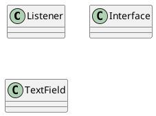
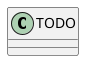

# OMD-TP2

# I. Introduction
Présentation du (projet/sujet)
Présentation de la méthodologie
Présentation de l'implémentation

# II. Déroulement

Comme pour le TP1, nous cherchons à nous approprier le sujet en faisant un cahier des charges plus lisible et plus adapté à la situation.
Cahier des charges :

Nous commençons ensuite par définir les différents graphoque UML nécessaires avant de commencer l'implémentation :
- Diagramme de classe
- Diagramme séquence
- Diagramme d'état

## II.1 Diagramme de classe

Puis nous nous lançons dans le diagramme de classe :

## II.2 Diagramme séquence

## II.3 Diagramme d'état

