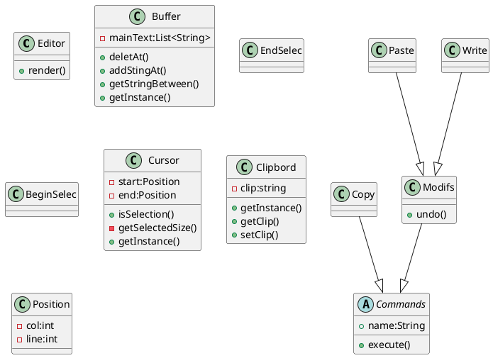

# OMD-TP2

# I. Introduction
Présentation du (projet/sujet)
Présentation de la méthodologie
Présentation de l'implémentation

# II. Déroulement

Comme pour le TP1, nous cherchons à nous approprier le sujet en faisant un cahier des charges plus lisible et plus adapté à la situation.
Cahier des
## Cahier des charges : 

### V1

- Le texte est contenu dans un buffer (zone de travail)
- Il  existe  une  notion  de  sélection  de  texte,  avec  des  commandes  utilisateur  permettant  de déplacer le début et la fin de la sélection
- Copie de la sélection dans le presse-papier
- Copie de la sélection dans le presse-papier puis effacement de la sélection
- Remplacement (« collage ») de la sélection par le contenu du presse-papier
- L'interface homme-machine est d'un type quelconque (textuelle ou graphique)

### V2

- D'enregistrer/rejouer les actions de l'utilisateur (e.g., script) 
- De réaliser le défaire/refaire, avec une capacité quelconque dans le défaire 
(autrement dit on peut revenir au début)

## Plan
çons ensuite par définir les différents graphoque UML nécessaires avant de commencer l'implémentation :
- Diagramme de classe
- Diagramme séquence
- Diagramme d'état

## II.1 Diagramme de classe

Puis nous nous lançons dans le diagramme de classe :

## II.2 Diagramme séquence

## II.3 Diagramme d'état

